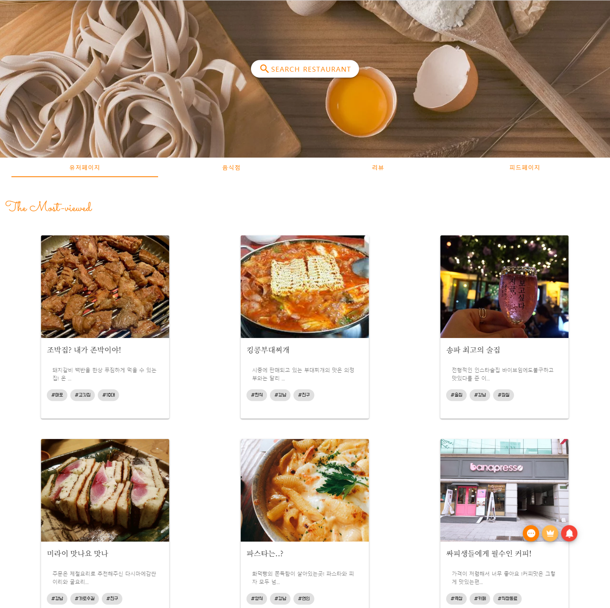
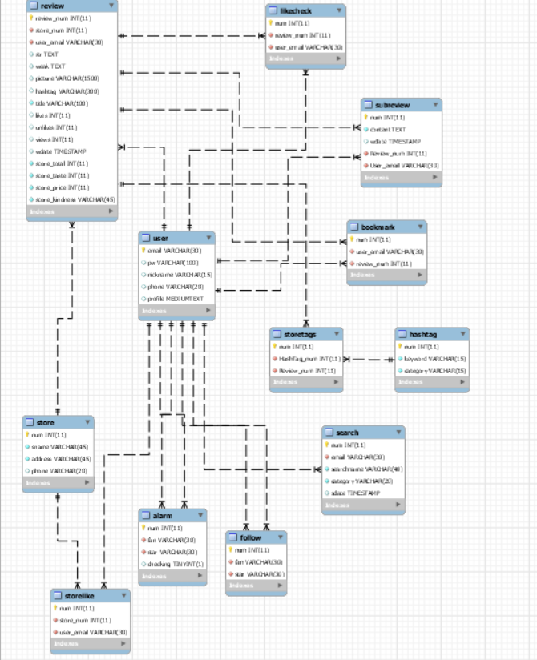

# UCC
[](https://www.youtube.com/embed/XDWX7yIv_Gw)

---

# 사용자 참여형 맛집리뷰 큐레이션 SNS, 리슐랭


---
## 메인화면




## Table of Contents

- [식당 리뷰 SNS](#%ec%8b%9d%eb%8b%b9-%eb%a6%ac%eb%b7%b0-sns)
  - [Table of Contents](#table-of-contents)
  - [Introduction](#introduction)
  - [사용기술](#%ec%82%ac%ec%9a%a9%ea%b8%b0%ec%88%a0)
  - [ERD 다이어그램](#erd-다이어그램)
  - [My Role](#my-role)
  - [Prerequisite](#prerequisite)
  - [Development](#development)
    - [Install](#install)
    - [Testing](#testing)
    - [Commit](#commit)
  - [Team](#team)
  - [Demo](#demo)
  - [Stack](#stack)
  - [license](#license)
  - [About](#about)
## Introduction
```
ssafy
|-- s02p12a404
|     `-- back
|		`-- bin
|		`-- Servers
|		`-- src
|		`-- target
|     `-- front-sk
|		`-- amplify
|		`-- public
|		`-- src
|--
```


## 사용기술

aws cognito API : 회원 가입에 필요한 이메일 인증 

Naver Login API : 간편 로그인 

GoogleMap API : 음식점 맛집 검색 및 정보 가져오기

Imgurl API : 이미지 업로드 및, 사진 가져오기

SpringSecurity + JWT : 로그인한 사용자만 서비스를 사용가능 하도록(filter), Token을 계속 검사해서 유효한 회원인지 확인

JPA(JAVA Persistent API) : 데이터베이스 관리 

Querydsl : 사용자가 원하는 쿼리 작성이 가능


## ERD 다이어그램




##  My Role

```
1. MySQL DB설계
2. Spring Boot, JPA를 이용한 REST api구현
3. 로그인 JWT 토큰 발급
4. Spring Security를 이용한 토큰인증 및 권한 설정
5. Querydsl로 사용자정의 쿼리문 구현
6. 리뷰리스트 페이지 구현(프론트)
7. AWS EC2 + Nginx로 프로젝트 배포
8. UCC 촬영 및 편집
```


## Prerequisite
We recommend using [nvm](https://github.com/creationix/nvm) (or [nvm-windows](https://github.com/coreybutler/nvm-windows)) to manage and install Node.js, which makes it easy to change the version of Node.js per project.
- [Yarn](https://yarnpkg.com): We use Yarn to install our Node.js module dependencies (rather than using npm).
- [Git Flow](https://github.com/nvie/gitflow/wiki/Installation): We are following Git Flow for maintaining software versions.
## Development
### Install
```bash
$ git clone https://github.com/Songwonseok/Rechelin.git
$ yarn install
```
### Testing
```bash
$ yarn run test
```
### Commit
We are following [Angular's commitizen rules](https://github.com/angular/angular.js/blob/master/DEVELOPERS.md#-git-commit-guidelines) for formatting git commit message. This allows you to read messages that are easy to understand when looking for project history. It also uses the git commit message to generate our [CHANGELOG](/CHANGELOG.md) file.
```bash
$ npm install -g git-cz
$ git add .
$ git git-cz
$ git push
```
## Team
- 송원석
- 김주연
- 김현지
- 황인규

## Demo
URL: [Rechelin](http://i02a404.p.ssafy.io/login)  
ID : sihyo5252@gmail.com  
PW : asdf1234#

## Stack


## license
MIT License
## About
Authored and maintained by **ssafy**

